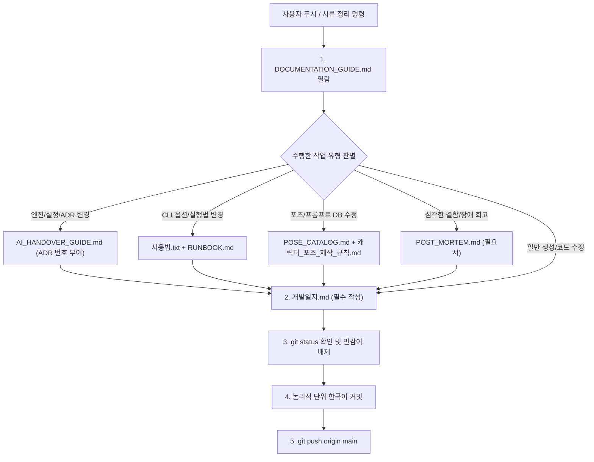

# 📚 플에파(PLEPA) 문서 작성 및 동기화 지침서 (Documentation Guide)

> **문서 목적**: 프로젝트 내 모든 기술 문서, 운영 매뉴얼, 개발일지의 역할과 형식을 정의하고, 작업 완료 후 또는 깃 푸시(Push) 명령 시 누락 없이 서류를 최신화하기 위한 단일 기준 지침서(SOP)입니다.  
> **적용 대상**: 모든 Antigravity AI 에이전트 및 프로젝트 기여자.  
> **핵심 원칙**: **"코드와 설정이 바뀌면 문서도 함께 살아 숨쉬어야 한다."** 서류 작업 또는 푸시 요청 시 **반드시 본 문서를 최우선 열람**하여 해당 문서를 동기화합니다.

---

## 🗺️ 1. 프로젝트 주요 문서 지도 (Document Map)

| 문서명 | 역할 및 성격 (SSOT) | 주요 갱신 타이밍 |
| :--- | :--- | :--- |
| **[`DOCUMENTATION_GUIDE.md`](DOCUMENTATION_GUIDE.md)** | [본 문서] 문서 작성 요령 및 푸시 전 체크리스트 기준서 | 문서 관리 체계나 프로토콜 변경 시 |
| **[`개발일지.md`](개발일지.md)** | 일자별 작업 로그, 트러블슈팅, 산출물, 다음 계획 기록 | **모든 작업 세션 마무리 및 푸시 직전 (필수)** |
| **[`AI_HANDOVER_GUIDE.md`](AI_HANDOVER_GUIDE.md)** | 마스터 인계서, 하드웨어 불변식, 핵심 아키텍처 의사결정(ADR) | 핵심 설계 변경, 새 ADR(19, 20...), 불변식 확정 시 |
| **[`RUNBOOK.md`](RUNBOOK.md)** | 실전 CLI 명령어 매뉴얼, 긴급 장애 조치 및 복구 가이드 | 신규 CLI 옵션 추가, 실행 절차 및 트러블슈팅 갱신 시 |
| **[`TROUBLESHOOTING_CHECKLIST.md`](TROUBLESHOOTING_CHECKLIST.md)** | 6대 기능 계층별 작동 점검 체크리스트 및 장애 진단 가이드 | 파이프라인 단계별 검증 규칙 및 진단 절차 변경 시 |
| **[`사용법.txt`](사용법.txt)** | 키로(Kiro) 100% 호환 원클릭 복사-실행 치트시트 | 신규 캐릭터/포즈 추가, CLI 명령어 문법 갱신 시 |
| **[`플에파_기능명세.md`](플에파_기능명세.md)** | 파이프라인/ComfyUI API/엔진 인터페이스 기술 규격서 | 백엔드 통신, 데이터 구조, 신규 엔진 기능 구현 시 |
| **[`THEME_PACK_GUIDE.md`](THEME_PACK_GUIDE.md)** | 전용 테마 팩 및 다이내믹 의상 스왑 포즈 제작 공식 지침서 | 신규 테마 팩(수영복, 바니걸, 전투 등) 설계 및 포즈 규격 확장 시 |
| **[`캐릭터_포즈_제작_규칙.md`](캐릭터_포즈_제작_규칙.md)** | SDXL/FLUX 캐릭터 JSON 및 80종 포즈 프롬프트 제작 완전 규칙 | 프롬프트 공식, 키워드 차단 규칙, 포즈 구조 변경 시 |
| **[`POSE_CATALOG.md`](POSE_CATALOG.md)** | 80종 포즈 2~4글자 명칭, 연출 의도(`description`) 카탈로그 | 포즈 라벨명 변경, 포즈 설명 추가 및 수정 시 |
| **[`ROADMAP_AND_ISSUES.md`](ROADMAP_AND_ISSUES.md)** | 기능 로드맵, 개발 우선순위 백로그 및 이슈 추적 | 신규 기능 기획, 마일스톤 완료, 버그 이슈 등록 시 |
| **[`POST_MORTEM.md`](POST_MORTEM.md)** | 심각한 장애 및 결함 사후 분석(원인, 타임라인, 재발 방지책) | 대규모 생성 실패, 메모리 크래시, 화질 참사 분석 시 |
| **[`README.md`](README.md)** | 프로젝트 소개, 설치 방법 및 빠른 시작 가이드 | 신규 유저 온보딩 환경 변화, 설치 의존성 변경 시 |

---

## ⚡ 2. 작업 유형별 문서 갱신 매트릭스 (Update Matrix)

작업을 완료했거나 푸시 명령을 받았을 때, 수행한 작업 유형에 해당하는 문서들을 체크리스트 형태로 확인하고 갱신합니다.



### 상세 갱신 조건

1. **아키텍처 및 시스템 결정 변경 시**:
   - `AI_HANDOVER_GUIDE.md`: 2.2절에 순번(예: `19. ...`, `20. ...`)을 매겨 배경, 원인 규명, 최종 결정 사항 기록.
   - `개발일지.md`: 해당 일자에 목표 및 의사결정 내역 기록.
2. **CLI 인터페이스 및 사용자 실행법 변경 시**:
   - `사용법.txt`: 사용자가 바로 복사해 터미널에 붙여넣을 수 있는 원클릭 명령어 예시 반영.
   - `RUNBOOK.md`: 2절에 상세 옵션 설명 추가.
   - `개발일지.md`: 사용법 변경 사항 기록.
3. **포즈 및 프롬프트 DB 변경 시**:
   - `sdxl_pose_database.json` / `flux_pose_database.json` 수정.
   - `POSE_CATALOG.md`: 라벨명 및 `description` 동기화.
   - `캐릭터_포즈_제작_규칙.md`: 프롬프트 조립 규칙 및 불변식 동기화.
   - `개발일지.md`: 포즈 개선 내역 및 대상 에셋 기록.
4. **모든 일반 작업 완료 및 푸시 시**:
   - **`개발일지.md` (필수)**: 당일 일자에 작업 내역 4단 템플릿으로 작성.

---

## 📝 3. 개발일지 작성 표준 템플릿 (`개발일지.md`)

`개발일지.md`는 최신 날짜가 맨 위로 오는 **역순(Reverse-chronological)**으로 기록하며, 반드시 아래 4단 규격을 준수합니다:

```markdown
### 📅 YYYY-MM-DD (요일) [- N차]

#### 1. 주요 작업 목표
1. **[핵심 목표 1]**:
   - 구체적인 달성 조건, 대상 캐릭터/포즈/엔진.
2. **[핵심 목표 2]**:
   - 상세 설명.

#### 2. 수행 내역 및 기술적 트러블슈팅 (Troubleshooting)
- **[문제점 / 실험 명칭]**:
  - **원인 분석**: 기술적 원인 (예: 샘플러 노이즈 재주입, 프롬프트 중복 등).
  - **해결 조치**: 코드/설정/프롬프트 구체적 수정 내역.
  - **실측 지표**: 소요 시간, 생성 수량, 비교 결과 등 수치화된 데이터.

#### 3. 최종 결과 및 산출물 (Artifacts)
- [x] [`파일명`](경로): 변경 및 생성 내용 요약.
- [x] `projects/{roster}/assets/`: 생성된 에셋 수량 및 상태.
- [x] 검증 리포트 아티팩트 링크 (있을 경우).

#### 4. 다음 계획 (Next Step)
- 후속으로 이어질 구체적 작업 1~2가지 제시.

---
```

---

## 🔒 4. 깃 커밋 및 푸시 5단계 프로토콜 (Pre-push Protocol)

사용자가 **"일지 써줘", "푸시해줘", "정리해줘"** 등을 지시하거나 세션을 마무리할 때 아래 5단계를 철저히 순서대로 수행합니다.

### [1단계] 문서 가이드 열람 및 변경 파일 매핑
- 본 [`DOCUMENTATION_GUIDE.md`](DOCUMENTATION_GUIDE.md)를 확인하여 금번 작업에서 변경된 코드/설정에 대응하는 문서 목록을 확정합니다.

### [2단계] 문서 최신화
- 매핑된 기술 문서([`AI_HANDOVER_GUIDE.md`](AI_HANDOVER_GUIDE.md), [`RUNBOOK.md`](RUNBOOK.md), [`사용법.txt`](사용법.txt) 등)를 수정합니다.
- [`개발일지.md`](개발일지.md)에 당일 작업 내역을 4단 규격에 맞추어 작성합니다.

### [3단계] `git status` 점검 및 민감어 필터링
- `git status`를 실행하여 스테이징되지 않은 파일이나 불필요한 임시 파일이 없는지 점검합니다.
- **[절대 엄수] 성인물, 신체 부위, 성적 행동 묘사 등 민감한 표현이 커밋 메시지에 단 한 단어도 포함되지 않도록 검열합니다.**

### [4단계] 논리적 단위 분할 커밋
- 파일 성격에 따라 분할 커밋을 원칙으로 합니다:
  - `fix:` 프롬프트 결함, 버그 수정, 렌더링 예외 처리
  - `feat:` 엔진 파라미터 동기화, UI 기능, 신규 캐릭터 프로필
  - `docs:` 개발일지 갱신, ADR 등록, 매뉴얼 최신화
  - `test:` 스냅샷 테스트, 베이스라인 검증

### [5단계] 원격 푸시 및 상태 확인
- `git push origin main` 실행.
- 푸시 후 `git status`를 재확인하여 `working tree clean` 상태인지 최종 검증합니다.
- 사용자에게 일지 작성 내용과 푸시 완료 내역을 일목요연하게 보고합니다.
