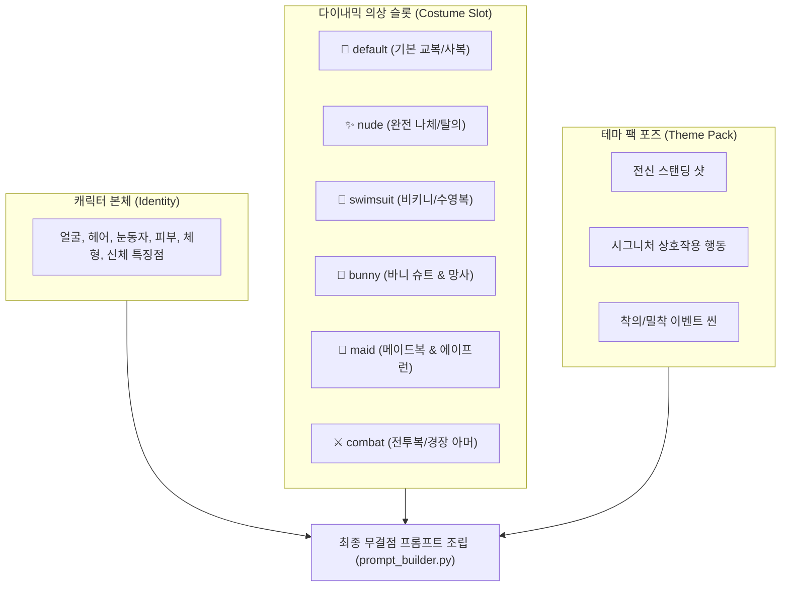

# 🎨 플에파(PLEPA) 테마 팩 및 전용 포즈 제작 가이드 (Theme Pack Guide)

> **문서 목적**: 기존의 공통 기본 포즈(000~079)에 더해, 각 작품(장르/세계관)에 맞춘 **전용 테마 팩(전투, 수영복, 메이드, 바니걸, 판타지 패배 이벤트 등)**을 설계하고 신규 제작할 때 누구나 일관된 고품질 규격으로 확장할 수 있도록 정의한 공식 표준 지침서(SOP)입니다.  
> **핵심 설계 철학**: **"캐릭터 본체 외모(Identity)는 불변, 의상(Costume Slot)은 자동 스왑, 포즈(Pose)는 레고 블록식 결합"**

---

## 🗺️ 1. 테마 팩 아키텍처 개요

플에파의 테마 팩 시스템은 **독립된 JSON 모듈 파일** 형태로 존재하며, 엔진이 이를 감지하여 기본 포즈 DB에 자동으로 병합(Merge)합니다.



---

## 🏷️ 2. 코드 명명 및 카테고리 접두사 규칙 (Naming Convention)

기존 3자리 숫자(`000~159`)와 충돌하지 않고 젠잇(Gen-IT) 및 비주얼노벨 플랫폼과 100% 호환되도록 **대분류 영문 접두사 + 2자리 숫자** 형식을 표준으로 사용합니다.

| 접두사 | 카테고리 명칭 | 권장 포즈 수량 | 주요 상황 및 연출 의도 | 의상 슬롯 (`required_outfit`) |
| :---: | :--- | :---: | :--- | :---: |
| **`A`** | **감정 / 표정 (Emotions)** | 20~32종 (`A01`~`A32`) | 평상, 미소, 분노, 삐짐, 눈물, **광기, 결연함, 취함, 질투** | `default` |
| **`B`** | **일상 / 상호작용 (Actions)** | 20~28종 (`B01`~`B28`) | 허그, **공주님 안기**, 넘어뜨림, 손잡기, **심한 부상, 결혼식** | `default` (또는 상황별) |
| **`D`** | **수영복 / 바캉스 (Swimsuit)** | 7~10종 (`D01`~`D10`) | 해변 전신, 물놀이, 선오일, 수영복 착의 밀착 씬 | `swimsuit` |
| **`F`** | **바니걸 (Bunny)** | 7~8종 (`F01`~`F08`) | 바니 전신, 파이즈리, 뒷태, 바니 슈트 착의 씬 | `bunny` |
| **`G`** | **메이드 / 앤틱 (Maid)** | 7~8종 (`G01`~`G08`) | 메이드 전신, 봉사, 홍차 서빙, 에이프런 착의 씬 | `maid` |
| **`E`** | **BDSM / 조교 (BDSM)** | 8~10종 (`E01`~`E10`) | 펨섭/펨돔 전신, 아마존 프레스, 풋잡, 초커/하네스 | `bdsm` |
| **`C`** | **전투 / 액션 (Combat)** | 5~10종 (`C01`~`C10`) | 전투 태세, 마법 영창, 무기 겨누기, 숨고르기, 승리 | `combat` |
| **`DE`** | **던전 패배 이벤트 (Defeat)** | 5~8종 (`DE01`~`DE08`) | 슬라임 포박, 촉수 함정, 몬스터 조우, 최면/함락 | `default` (파손) / `nude` |
| **`N`** | **성인 이벤트 씬 (Adult)** | 50~80종 (`N01`~`N83`) | 정통 체위, 단계 분기(시작/절정/후), 착의/탈의 분기 | `nude` / `default` |

> 💡 **코드 자동 정규화 규칙**: CLI나 입력창에서 `d1` 또는 `D1`로 입력해도 엔진이 내부적으로 `D01`로 자동 패딩하여 인식합니다.

---

## 📐 3. 테마 팩 '7~8단 풀코스 공식' (Best Practice)

새로운 코스튬이나 컨셉 테마 팩을 설계할 때는 아래의 **7~8단 공식**을 따르면 어떤 테마든 완벽한 기승전결 스토리라인이 완성됩니다:

```text
[1] 01번: 전신 스탠딩 샷 (Full Body Standing) ➔ 해당 테마 의상의 전체 실루엣과 배경 소개
[2] 02번: 특화 제스처 1 (테마 시그니처 활동)  ➔ 예: 물놀이, 홍차 서빙, 마법 시전
[3] 03번: 특화 제스처 2 (감정 교류 및 휴식)   ➔ 예: 선베드 오일, 턱 괴고 올려다보기, 숨고르기
[4] 04번: 착의 밀착 씬 1 (정상위 / 대면)      ➔ 해당 의상을 입은 채 마주보는 친밀한 씬
[5] 05번: 착의 밀착 씬 2 (후배위 / 배면)      ➔ 뒤태와 의상 라인이 강조되는 역동적 씬
[6] 06번: 착의 밀착 씬 3 (입위 / 스탠딩)      ➔ 벽이나 소품에 기댄 채 진행되는 긴장감 있는 씬
[7] 07번: 특화 봉사 씬 (구강 / 가슴)          ➔ 무릎을 꿇고 올려다보는 봉사 구도
```

---

## 📄 4. JSON 파일 작성 규격 및 템플릿

### 4.1 기본 템플릿 구조
테마 파일은 반드시 아래의 JSON 스키마를 준수해야 합니다:

```json
{
  "테마명": {
    "코드": {
      "label": "한글 라벨 (2~6글자)",
      "required_outfit": "의상슬롯키",
      "sdxl_prompt": "SDXL Danbooru 태그 프롬프트",
      "flux_prompt": "FLUX T5 영문 서술형 자연어 프롬프트",
      "description": "상황 및 연출 의도 상세 설명"
    }
  }
}
```

### 4.2 실제 작성 예시 (`themes/swimsuit.json`)
```json
{
  "swimsuit": {
    "D01": {
      "label": "수영복전신",
      "required_outfit": "swimsuit",
      "sdxl_prompt": "full body, standing, smiling, sunny beach, ocean, tropical summer, blue sky",
      "flux_prompt": "A complete full-length shot of the character standing gracefully on a sunny tropical beach with clear turquoise ocean and blue sky in the background.",
      "description": "수영복 차림의 전신 스탠딩 샷. 맑은 해변 배경."
    },
    "D02": {
      "label": "물놀이",
      "required_outfit": "swimsuit",
      "sdxl_prompt": "upper body, splashing water, happy laugh, sparkling ocean, summer beach, wet hair",
      "flux_prompt": "Upper body view of the character happily playing in the ocean, splashing crystal clear water towards the viewer with a joyful laughing expression, slightly wet hair.",
      "description": "바닷물에서 즐겁게 물장구를 치며 웃는 역동적인 물놀이 씬."
    }
  }
}
```

### 4.3 성별 분기 프롬프트 작성법 (`prompt_female` vs `prompt_otokonoko`)
성별(여성 vs 오토코노코)에 따라 체형이나 상호작용 경로가 달라지는 이벤트 씬의 경우, 단일 코드를 유지한 채 내부 프롬프트를 분기할 수 있습니다:

```json
{
  "adult": {
    "N01": {
      "label": "정상위삽입",
      "required_outfit": "nude",
      "flux_prompt_female": "missionary position, male partner on top, vaginal penetration, gentle thrusting, blushing face, looking up with pleasure",
      "flux_prompt_otokonoko": "missionary position, male partner on top, receptive anal sex, slender feminine boy body, small male member visible, blushing intensely with teary eyes",
      "sdxl_prompt_female": "1girl, 1boy, missionary, vaginal penetration, blushing",
      "sdxl_prompt_otokonoko": "1boy, 1boy, missionary, anal, receptive, otokonoko, blushing",
      "description": "정상위 삽입 씬 (여성: 전면 기본 경로 / 오토코노코: 후방 경로 및 전용 체형 묘사)"
    }
  }
}
```
* **동작 원리**: 캐릭터 JSON의 `"gender"` 속성을 검사하여:
  - `gender == "otokonoko"` ➔ `prompt_otokonoko` 자동 채택
  - `gender == "female"` (또는 미지정) ➔ `prompt_female` 자동 채택
  - 분기 필드가 없으면 기본 `flux_prompt` / `sdxl_prompt` 폴백 적용

---

## 🗂️ 5. 파일 저장 및 배치 규칙 (Directory Layout)

작성한 테마 JSON 파일은 적용 범위에 따라 두 가지 위치에 저장할 수 있습니다:

### ① 전역 공용 테마 팩 (모든 작품/로스터 공유)
* **경로**: 루트의 **`themes/`** 폴더
* **예시**: `themes/swimsuit.json`, `themes/bunny.json`, `themes/maid.json`
* **효과**: 모든 로스터(`hey`, `maid`, `ykn` 등)의 모든 캐릭터가 별도 설정 없이 즉시 해당 테마를 사용할 수 있습니다.

### ② 특정 작품 전용 테마 팩 (해당 로스터 독점)
* **경로**: **`projects/{roster}/themes/`** 폴더 (또는 `projects/{roster}/custom_poses.json`)
* **예시**: `projects/hey/themes/combat.json` (마법 아카데미 전용 마법/전투 테마)
* **효과**: 오직 `hey` 로스터의 캐릭터들만 이 전투 테마를 불러와 생성할 수 있습니다.

---

## 👗 6. 캐릭터 맞춤 의상 등록법 (Character JSON)

테마 팩은 기본적으로 공용 의상(`DEFAULT_THEME_OUTFITS`)으로 동작하지만, **특정 캐릭터에게 그 캐릭터만의 시그니처 테마 의상**을 입히고 싶다면 캐릭터 JSON에 슬롯을 추가하면 됩니다:

* **대상 파일**: `projects/{roster}/characters/{prefix}.json` (예: `mal.json`)
* **설정 방법**: `"outfits"` 항목에 해당 테마 키를 등록:

```json
{
  "prefix": "mal",
  "name": "마레나",
  "gender": "female",
  "appearance": {
    "face_and_hair": "platinum blonde long hair, blue eyes",
    "physique": "slender body, huge breasts",
    "outfit": "white collared shirt, navy blue blazer, pleated skirt"
  },
  "outfits": {
    "default": "white collared shirt, navy blue blazer, pleated skirt",
    "swimsuit": "luxury emerald green micro bikini, halterneck bikini top, side-tie bikini bottom",
    "bunny": "purple velvet bunny suit, black fishnet tights, bunny ears",
    "maid": "royal navy maid dress, white frilled apron, lace headdress",
    "combat": "dragon-scale combat leotard, light gold chestplate, leather gloves"
  }
}
```

> 💡 **작동 결과**:
> - `D01` 생성 시 기본 공용 비키니 대신 마레나 전용의 **"에메랄드 그린 비키니"**가 1순위로 자동 장착됩니다.

---

## ✍️ 7. 프롬프트 작성 3대 핵심 규칙 (Prompt Engineering)

테마 팩 프롬프트를 작성할 때 반드시 지켜야 할 불변식입니다:

### ① 기존 의상 언급 절대 금지
- 테마 포즈의 프롬프트(`sdxl_prompt`, `flux_prompt`) 안에는 **캐릭터의 원래 옷(교복, 블레이저 등)이나 얼굴/헤어 색상을 절대 적지 마십시오.**
- 오직 **"해당 상황의 동작, 구도, 배경, 소품"**만 기술합니다. (의상은 `required_outfit` 슬롯이, 외모는 캐릭터 본체 엔진이 자동으로 결합합니다.)

### ② 2인 상호작용 주체 분리 기법 (`C` vs `U`)
2인 씬(허그, 공주님 안기, 벽치기 등)에서는 주체와 대상을 명확히 서술해야 구도 왜곡이 발생하지 않습니다:
- **C(여캐) 주도**: `woman hugging man from behind, leaning against man, couple, 1boy, 1girl`
- **U(남주) 주도**: `man carrying woman in bridal style, princess carry, couple, 1boy, 1girl`

### ③ 3단계 타임라인 명시 (진행형 vs 절정 vs 사정 후)
스토리 흐름이 필요한 씬은 상황 끝에 단계 태그를 부여합니다:
- **시작 (시작 단계)**: `blushing, shy gaze, hesitation`
- **절정 (클라이맥스)**: `flushed face, open mouth, heavy breathing, trembling`
- **후 (필로토크/여운)**: `exhausted, peaceful smile, hugging towel, messy hair`

---

## 🧪 8. 신규 테마 팩 검증 및 테스트 체크리스트

새로운 테마 팩 JSON을 만든 후 터미널에서 다음 3단계로 검증합니다:

```powershell
# 1단계: 프롬프트 조립 및 파일명 무결성 사전 검증 (GPU 미사용, 0.1초 소요)
python flux_batch_generator.py -r hey -c mal -p D --dry-run

# 2단계: 더미 가상 생성으로 디스크 I/O 및 경로 무결성 검증 (0.01초 소요)
python flux_batch_generator.py -r hey -c mal -p D --mock

# 3단계: 단일 포즈 1장 실측 생성으로 실제 화질 및 의상 스왑 검증
python flux_batch_generator.py -r hey -c mal -p D01
```

---

## 📌 9. 요약: 신규 테마 팩 제작 5줄 가이드

1. **접두사 선정**: 수영복(`D`), 바니걸(`F`), 메이드(`G`), 전투(`C`), 패배이벤트(`DE`) 중 선택.
2. **7단 공식 설계**: 전신 스탠딩 ➔ 제스처 2종 ➔ 착의 밀착 3종 ➔ 봉사 1종 구성.
3. **JSON 작성**: `required_outfit` 슬롯 명시 및 상황 중심 영문 프롬프트 작성.
4. **파일 저장**: 공용은 `themes/{테마명}.json`, 로스터 전용은 `projects/{로스터}/themes/{테마명}.json`.
5. **실측 실행**: `python flux_batch_generator.py -r {로스터} -c {캐릭터} -p {접두사}`로 원클릭 생성.
