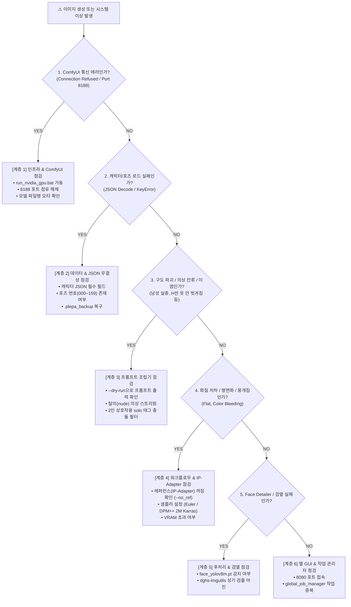

# 🛠️ 플에파(PLEPA) 단계별 작동 체크리스트 및 장애 진단 가이드 (Troubleshooting Checklist)

> **문서 목적**: 시스템 이상이나 이미지 생성 실패, 구도/화질 결함이 발생했을 때, 어느 계층(인프라, 데이터, 프롬프트, 워크플로우, 후처리, GUI)에서 문제가 발생했는지 1분 안에 핀포인트로 파악하고 즉각 조치하기 위한 단일 기준 점검 매뉴얼(SOP)입니다.  
> **적용 대상**: 모든 사용자 및 투입된 Antigravity AI 에이전트.

---

## 🗺️ 1. 한눈에 보는 문제 진단 트리 (Diagnostic Flowchart)

---

## ⚡ 2. 10초 원클릭 긴급 진단 명령어

장애 발생 시 터미널에서 아래 명령어들을 순서대로 실행하여 문제 지점을 즉시 격리합니다:

| 점검 목적 | CLI 명령어 | 정상 기대 결과 |
| :--- | :--- | :--- |
| **전체 무결성 자체 진단** | `python flux_batch_generator.py --test` | `[PASS] 모든 진단 검사 항목을 통과했습니다.` |
| **ComfyUI 포트 연결 점검** | `Test-NetConnection -ComputerName 127.0.0.1 -Port 8188` | `TcpTestSucceeded : True` |
| **프롬프트 조립 점검 (GPU 미사용)** | `python flux_batch_generator.py -r hey -c mal -p 034 --dry-run` | 조립된 프롬프트 콘솔 출력 |
| **파일 I/O 및 파이프라인 점검** | `python flux_batch_generator.py -r hey -c mal -p 000 --mock` | 0.001초 만에 더미 WebP 생성 성공 |
| **단위 테스트 전수 검증** | `.\.venv\Scripts\python.exe -m pytest` | `14 passed` |

---

## 📋 3. 계층별 세부 작동 체크리스트

### 🔌 [계층 1] 인프라 & ComfyUI 백엔드 통신 (Infrastructure Layer)
> **역할**: GPU 연산 엔진 및 체크포인트/UNet 로드, WebSocket 통신을 담당하는 최하단 기반 계층.

- [ ] **ComfyUI 가동 상태**: 브라우저에서 `http://127.0.0.1:8188`에 접속 시 정상 화면이 열리는가?
- [ ] **포트 충돌(8188)**: 백그라운드에 좀비 프로세스가 물려있지 않은가?
  - *조치*: `Get-NetTCPConnection -LocalPort 8188 | ForEach-Object { Stop-Process -Id $_.OwningProcess -Force }`
- [ ] **체크포인트 파일 실존**: `ComfyUI/models/checkpoints/` 폴더 내에 지정된 모델 파일(예: `unholyDesireMixSinister_v90.safetensors`, `flatbreadIL_v60.safetensors`)이 오타 없이 존재하는가?
- [ ] **VRAM 누수/초과**: RTX 4060 Ti(8GB)에서 CUDA Out of Memory 발생 시 모델 캐시 비우기 실행:
  - *조치*: `Invoke-RestMethod -Method Post -Uri "http://127.0.0.1:8188/free" -Body '{"unload_models": true, "free_memory": true}' -ContentType "application/json"`

---

### 💾 [계층 2] 데이터 & JSON 스키마 계층 (Data & Schema Layer)
> **역할**: 캐릭터 프로필, 80종 포즈 DB, 배경 프리셋의 데이터 무결성을 보장하는 계층.

- [ ] **캐릭터 JSON 구문 검증**: `projects/{roster}/characters/*.json` 파일에 JSON 문법 오류(쉼표 누락, 따옴표 누락)나 필수 필드(`prefix`, `appearance`, `gender`) 누락이 없는가?
- [ ] **포즈 DB 무결성**: `sdxl_pose_database.json` 및 `flux_pose_database.json`에 대상 코드(`000`~`159`)와 `prompt`, `label`이 올바르게 존재하는가?
- [ ] **손상 시 안전 복구**: 파일 손상 발생 시 `.plepa_backup/` 폴더에서 직전 정상 버전 복원이 가능한가?

---

### 🧠 [계층 3] 프롬프트 조립 & 엔진 로직 계층 (Prompt Builder Layer)
> **역할**: 캐릭터 외형 + 포즈 DB + 배경 + 보정 태그를 결합하여 최종 긍정/부정 프롬프트를 만드는 계층.

- [ ] **착의 vs 탈의(H-씬) 스트리핑**:
  - H-씬(040~059, 140~159) 생성 시 캐릭터 기본 의상 단어(`sweater`, `skirt`, `dress` 등)가 완전히 제거되고 `nude, completely nude`만 남았는가?
- [ ] **2인 상호작용 충돌 필터링**:
  - 파트너가 존재하는 포즈에서 캐릭터 기본의 `solo` 태그가 자동으로 제거되었는가?
  - SDXL 네거티브에서 `1boy, male`이 자동 배제되어 남성 파트너가 정상 생성되는가?
- [ ] **헤어/색상 이염(Color Bleeding) 방지**:
  - 남성 모브 태그 주입으로 인해 여주인공의 머리색(예: 백금발)이 검게 변하지 않도록 포지티브 3중 앵커링이 작동하는가?
- [ ] **다중 남성(2boys) 소환 방지**:
  - 포즈 태그에 이미 `1boy`가 포함된 경우 추가 모브 프롬프트가 중복 주입되지 않는가?

---

### ⚙️ [계층 4] 워크플로우 템플릿 & 이미지 생성 I/O 계층 (Workflow & Generation Layer)
> **역할**: 조립된 프롬프트와 파라미터를 ComfyUI 노드 그래프로 묶어 전송하고 WebP 파일로 저장하는 계층.

- [ ] **IP-Adapter(레퍼런스) 완전 비활성화 여부**:
  - 기본 생성 시 레퍼런스 노드가 제외되었는가? (`no_ref=True`, `ref_weight=0.0`)
  - *주의: IP-Adapter가 켜져 있으면 2인 씬이나 특수 체위에서 심각한 인체 왜곡 및 텍스처 뭉개짐(Flat) 발생*
- [ ] **출력 디렉터리 권한 및 경로**:
  - `projects/{roster}/assets/{prefix}/` 폴더 생성 및 WebP 저장 권한에 이상이 없는가?
- [ ] **강제 덮어쓰기 플래그**:
  - 기존 파일 교체 시 `--overwrite` (또는 `-f`) 옵션이 부여되었는가?

---

### 🎨 [계층 5] 후처리 & 보정/검열 계층 (Post-Processing & Censor Layer)
> **역할**: Face Detailer 얼굴 보정, 4x 업스케일, 성기 자동 검열을 수행하는 계층.

- [ ] **Face Detailer 얼굴 인식**:
  - `ComfyUI/models/ultralytics/bbox/face_yolov8m.pt` 모델이 정상 로드되어 얼굴 검출 스킵 없이 보정되는가?
- [ ] **2D 성기 자동 검열 (`--censor`)**:
  - 나체/H씬에서 성기 인식 모델(`dghs-imgutils`)이 0.02초 내에 BBox를 잡고 `_censored.webp`를 정상 생성하는가?
  - 무검열 원본 파일이 훼손 없이 온전히 보존되는가?

---

### 🖥️ [계층 6] 웹 GUI & 백그라운드 작업 계층 (Web Studio & Job Layer)
> **역할**: NiceGUI 웹 화면 서빙 및 비동기 작업 스케줄링을 담당하는 최상단 사용자 인터페이스 계층.

- [ ] **웹 서버 가동 여부**: `http://127.0.0.1:8080`이 브라우저에서 정상 열리는가?
- [ ] **전역 작업 관리자 (`global_job_manager`)**:
  - 다른 작업이 이미 실행 중이어서 충돌하지 않는가?
  - 작업 취소 버튼이 정상 반응하여 배치를 안전하게 중단시키는가?
- [ ] **윈도우 탐색기 연동**: 라이트박스의 `PC 폴더 열기` 클릭 시 파일 탐색기 창이 정상 팝업되는가?
- [ ] **새 탭 고화질 뷰어 (`/view_image`)**: WebP 클릭 시 다운로드로 튕기지 않고 브라우저 탭 내에서 1:1 줌 인/아웃이 동작하는가?

---

## 🚨 4. 주요 증상별 원인 및 즉각 조치 빠른 표 (Quick Fix Reference)

| 현상 / 증상 | 근본 원인 | 즉각 조치법 |
| :--- | :--- | :--- |
| **화질이 뭉개지고 평면화(Flat)됨** | IP-Adapter(레퍼런스) 과포화 간섭 | `--no_ref` 기본값 확인, `mal.json`의 `ref_weight: 0.0` 유지 |
| **남성 파트너가 생성되지 않거나 기괴함** | 캐릭터 태그의 `solo` 및 네거티브 `1boy` 충돌 | `prompt_builder.py`의 2인 감지 자동 필터 가동 확인 |
| **남성이 2명 이상 생성됨 (2boys 결함)** | 포즈 프롬프트와 모브 프롬프트의 중복 `1boy` 주입 | 포즈 태그에 `1boy` 포함 시 `mob_positive` 주입 차단 로직 확인 |
| **H씬에서 옷이 벗겨지지 않음** | 캐릭터 의상 태그 가중치가 너무 높음 (`:1.3` 이상) | 캐릭터 JSON 의상 태그 가중치를 1.0 평문으로 낮춤 |
| **여캐 머리색이 검게 오염됨 (Color Bleeding)** | 남성 모브의 `short black hair` 태그 누출 | 여캐 포지티브에 `((hair color:1.35))` 앵커링 주입 |
| **ComfyUI 작업 큐 전송 시 HTTP 400 에러** | 체크포인트 파일명 오타 (언더스코어 누락 등) | `mal.json` 내 `checkpoint` 이름을 ComfyUI 실제 파일명과 일치시킴 |
| **GUI에서 "이미 실행 중" 알림 발생** | 이전 백그라운드 배치가 아직 미종료 상태 | `작업 취소` 버튼 클릭 또는 잠시 대기 후 재시도 |
