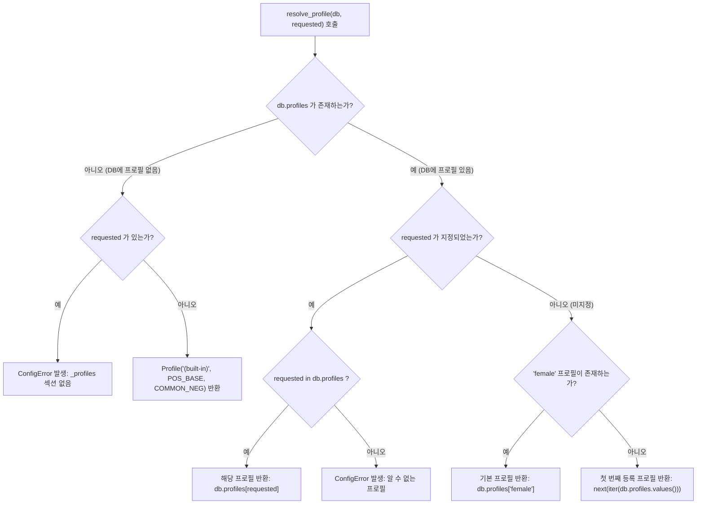

# Kiro 프로젝트 `_profiles` 구조 및 프로필 해석 메커니즘 분석 명세서

> **문서 버전**: v1.0.0  
> **분석 대상**: Kiro 프로젝트 (`pose_database.json`, `generator/pose_db.py`, `generator/models.py`, `generator/runner.py`)  
> **작성 목적**: Kiro의 프로필 시스템(`_profiles`, `base_positive`, `base_negative`, `resolve_profile`) 설계 구조 분석 및 플에파(PLEPA) 차세대 에셋 파이프라인 연계 사양 정립  

---

## 1. 개요 및 분석 배경 (Overview)

Kiro(키로) 프로젝트의 초기 파이프라인은 캐릭터 생성 시 **인물의 본질적인 성별/체형(Profile)**과 **표정/행동/구도(Pose & Emotion)**를 서로 독립적인(직교하는, orthogonal) 축으로 분리하여 관리하는 아키텍처를 채택했습니다.

- **포즈/감정 데이터 (`emotions`, `poses`, `h_scenes` 등)**: 모든 인물이 공통으로 취할 수 있는 신체 포즈와 감정 표현을 정의합니다.
- **프로필 데이터 (`_profiles`)**: 캐릭터의 기본 성별, 인체 특징, 품질 베이스라인, 그리고 해당 성별에서 절대 나오면 안 되는 요소들을 규정합니다.

이러한 분리 설계를 통해 포즈 프롬프트 안에 `1girl`이나 `1boy` 같은 성별 태그를 일일이 중복 기재하지 않고도, 프로필 선택(`--profile`) 하나만으로 남성, 여성, 오토코노코(여장소년) 등 다양한 인물군을 동일한 포즈 데이터베이스 상에서 일관되게 렌더링할 수 있도록 구현되었습니다.

---

## 2. `_profiles` 섹션 상세 구조 (Data Schema)

### 2.1 위치 및 네이밍 규칙
`_profiles`는 `pose_database.json`의 최상위 루트에 위치하는 특수 메타 섹션입니다.
- 언더스코어(`_`) 접두사(`_profiles`, `_schema` 등)로 명명되어, 일반 포즈 섹션(`_iter_sections`) 파싱 루프에서 자동으로 건너뛰어집니다.
- `_parse_profiles()` 전용 파서를 통해 `dict[str, Profile]` 데이터 매핑으로 독립 적재됩니다.

### 2.2 등록된 3대 프로필 정의
Kiro의 `pose_database.json`에는 3종류의 핵심 인물 프로필이 등록되어 있습니다:

| 프로필 키 (`Key`) | 대상 인물 유형 | 설명 |
| :--- | :--- | :--- |
| **`female`** | 기본 여성형 캐릭터 | 파이프라인의 기본값(`DEFAULT_PROFILE`). 1girl, 솔로, 여성 체형 |
| **`male`** | 남성형 캐릭터 | 1boy, 솔로, 남성미(`masculine`) 중심 |
| **`male_otokonoko`** | 오토코노코 (여장/중성 소년) | 1boy 베이스 + 중성적이고 섬세한 여성형 얼굴/슬렌더 체형 |

### 2.3 `_profiles` 원본 JSON 데이터
```json
{
  "_profiles": {
    "female": {
      "base_positive": "masterpiece, best quality, highly detailed, clean background, soft lighting, character portrait, cowboy shot, 1girl, solo",
      "base_negative": "worst quality, low quality, blurry, bad anatomy, bad hands, extra fingers, extra limbs, deformed, disfigured, watermark, signature, text, jpeg artifacts, cropped, 1boy, male, masculine, beard, mustache, facial hair, muscular, animal ears, cat ears, beast ears, fox ears, dog ears, animal tail"
    },
    "male": {
      "base_positive": "masterpiece, best quality, highly detailed, clean background, soft lighting, character portrait, cowboy shot, 1boy, solo, masculine",
      "base_negative": "worst quality, low quality, blurry, bad anatomy, bad hands, extra fingers, extra limbs, deformed, disfigured, watermark, signature, text, jpeg artifacts, cropped, 1girl, female, breasts, feminine"
    },
    "male_otokonoko": {
      "base_positive": "masterpiece, best quality, highly detailed, clean background, soft lighting, character portrait, cowboy shot, 1boy, solo, androgynous, feminine face, slender build, flat chest, delicate features",
      "base_negative": "worst quality, low quality, blurry, bad anatomy, bad hands, animal ears, cat ears, beast ears, fox ears, dog ears, animal tail, extra fingers, extra limbs, deformed, disfigured, watermark, signature, text, jpeg artifacts, cropped, 2boys, multiple characters, clone, duplicate, 1girl, female, breasts, large breasts, heavy cleavage, female genitalia, female anatomy, muscular, manly, beard, mustache, facial hair, uncensored, no censor, thin censorship, visible penis, large penis, erection, testicles, freckles, skin spots, blemishes, complex background"
    }
  }
}
```

---

## 3. `base_positive` & `base_negative` 필드 구조 및 상세 분석

각 프로필 객체는 `base_positive`와 `base_negative`라는 2개의 핵심 문자열 필드로 구성됩니다.

```python
@dataclass(frozen=True, slots=True)
class Profile:
    name: str
    base_positive: str
    base_negative: str
```

### 3.1 `base_positive` 필드 분석
`base_positive`는 해당 프로필로 렌더링되는 모든 이미지의 긍정 프롬프트 최전방에 배치되는 베이스라인입니다. 크게 3단계의 태그 그룹으로 구성됩니다:

1. **품질 및 라이팅 공통 태그**:
   - `masterpiece, best quality, highly detailed, clean background, soft lighting, character portrait, cowboy shot`
   - 모델의 전반적인 품질을 견인하고, 배경 난잡함을 방지하며 기본 카우보이 샷 구도를 확보.
2. **개체 수 및 성별 식별 태그**:
   - `female`: `1girl, solo`
   - `male`: `1boy, solo, masculine`
   - `male_otokonoko`: `1boy, solo, androgynous, feminine face, slender build, flat chest, delicate features`
3. **체형 및 외모 특징 제어**:
   - 특히 `male_otokonoko` 프로필은 단순 남성이 아닌 미소년/여장 캐릭터 특유의 `androgynous`(중성적), `feminine face`(여성적인 얼굴선), `slender build`(가느다란 체구), `flat chest`(빈유/평평한 가슴), `delicate features`(섬세한 이목구비)를 프롬프트 최전선에 명시하여 AI가 굵직한 남성형을 생성하는 것을 원천 방지합니다.

### 3.2 `base_negative` 필드 분석
`base_negative`는 반대 성별의 속성 오염과 저품질 요소를 차단하는 강력한 방어선입니다:

```
[공통 네거티브 레이어]
worst quality, low quality, blurry, bad anatomy, bad hands, extra fingers, 
extra limbs, deformed, disfigured, watermark, signature, text, jpeg artifacts, cropped
```

| 프로필 | 전용 차단 요소 (배제 태그) | 차단 목적 |
| :--- | :--- | :--- |
| **`female`** | `1boy, male, masculine, beard, mustache, facial hair, muscular, animal ears, cat ears, beast ears, fox ears, dog ears, animal tail` | 남성성 유입 방지(수염, 근육) 및 의도치 않은 동물 귀/꼬리 변이 원천 차단 |
| **`male`** | `1girl, female, breasts, feminine` | 여성성 및 가슴 생성 방지 |
| **`male_otokonoko`** | `1girl, female, breasts, large breasts, heavy cleavage, female genitalia, female anatomy` + `muscular, manly, beard, mustache, facial hair` + `2boys, multiple characters, clone` + `uncensored, visible penis, erection, testicles` + `animal ears, freckles, blemishes, complex background` | **[양방향 극단 차단]**<br>1) 완전한 여성 신체/가슴 생성 차단<br>2) 근육질/수염/남성미 생성 차단<br>3) 불필요한 성기 노출/난잡한 배경 차단 |

> [!NOTE]
> `male_otokonoko`의 `base_negative`는 **여성형의 극단(풍만한 가슴, 여성 성기)**과 **남성형의 극단(근육, 수염, 마초성)**을 양쪽 모두 네거티브에 배치함으로써, 그 정중앙에 위치한 **"여성처럼 예쁜 미소년"**의 좁은 표현 영역을 정밀하게 타겟팅하는 고도의 네거티브 엔지니어링 기법을 보여줍니다.

---

## 4. 프로필 해석 및 사용 메커니즘 (`generator/pose_db.py`)

### 4.1 프로필 파싱 로직 (`_parse_profiles`)
`pose_database.json` 최상위에서 `_profiles` 키를 안전하게 추출하고 유효성을 검증합니다:

```python
def _parse_profiles(raw: dict[str, Any], warnings: list[str]) -> dict[str, Profile]:
    section = raw.get(PROFILES_KEY)  # "_profiles"
    if section is None:
        return {}
    if not isinstance(section, dict):
        warnings.append(f"'{PROFILES_KEY}' 가 딕셔너리가 아님 - 프로필 무시")
        return {}

    profiles: dict[str, Profile] = {}
    for name, body in section.items():
        if not isinstance(body, dict):
            warnings.append(f"프로필 '{name}' 이 딕셔너리가 아님 - 무시")
            continue

        positive = body.get(PROFILE_POSITIVE_KEY)   # "base_positive"
        negative = body.get(PROFILE_NEGATIVE_KEY, "") # "base_negative"

        if not isinstance(positive, str) or not positive.strip():
            warnings.append(f"프로필 '{name}' 의 {PROFILE_POSITIVE_KEY} 가 없거나 비어 있음 - 무시")
            continue
        if not isinstance(negative, str):
            warnings.append(f"프로필 '{name}' 의 {PROFILE_NEGATIVE_KEY} 가 문자열이 아님 - 빈값 사용")
            negative = ""

        profiles[name] = Profile(name, positive.strip(), negative.strip())

    return profiles
```

### 4.2 프로필 해석 로직 (`resolve_profile`)
사용자가 CLI 인자(`--profile`)나 캐릭터 JSON 설정(`cfg.profile`)을 통해 프로필을 요청했을 때, 우선순위와 폴백(Fallback) 규칙에 따라 최종 `Profile` 인스턴스를 반환합니다:



```python
def resolve_profile(db: PoseDatabase, requested: str | None) -> Profile:
    """--profile 값을 Profile 로 해석한다."""
    # 1. DB에 _profiles 섹션이 아예 없는 경우
    if not db.profiles:
        if requested:
            raise ConfigError(
                f"프로필 '{requested}' 을 쓸 수 없습니다. "
                f"{POSE_DB_FILE} 에 '{PROFILES_KEY}' 섹션이 없습니다.",
                f"'{PROFILES_KEY}' 를 추가하거나 --profile 을 생략하세요.",
            )
        # 내장 기본 상수(POS_BASE, COMMON_NEG)로 안전하게 폴백
        return Profile(FALLBACK_PROFILE, POS_BASE, COMMON_NEG)

    # 2. 사용자가 특정 프로필을 명시적으로 요청한 경우
    if requested:
        if requested not in db.profiles:
            raise ConfigError(
                f"알 수 없는 프로필 '{requested}'. 사용 가능: {db.profile_names}",
                f"{POSE_DB_FILE} 의 '{PROFILES_KEY}' 섹션을 확인하세요.",
            )
        return db.profiles[requested]

    # 3. 미지정 시 기본 'female' 프로필 선택
    if DEFAULT_PROFILE in db.profiles:
        return db.profiles[DEFAULT_PROFILE]

    # 4. 'female'도 없으면 첫 번째 프로필 선택
    return next(iter(db.profiles.values()))
```

### 4.3 런타임 프롬프트 파이프라인 결합 (`runner.py` & `prompt.py`)
`resolve_profile`을 통해 결정된 프로필 객체는 런타임에 캐릭터 외형 및 포즈와 다음과 같이 순차 조립됩니다:

1. **기본 포지티브/네거티브 결합**:
   ```python
   profile = resolve_profile(db, args.profile)
   base_positive = join_tags(profile.base_positive, char_prompt)
   negative_prompt = join_tags(profile.base_negative, args.custom_neg)
   ```
2. **태그 충돌 검출 (`find_tag_conflicts`)**:
   - `base_positive`와 `negative_prompt` 양쪽에 동일한 태그가 들어가는 실수를 방지하기 위해 태그 정규화 후 교집합을 검출하여 콘솔에 경고(`[WARN] 태그 충돌`)를 출력합니다.
3. **최종 포즈 조립 (`assemble_prompt`)**:
   - 각 포즈 순회 시 포즈 프롬프트(`pose_prompt`)와 결합:
   ```python
   # BREAK 문법 지원 (품질/포즈 청크와 외형 청크 분리)
   if " BREAK " in base_positive:
       quality_part, char_part = base_positive.split(" BREAK ", 1)
       prompt = f"{join_tags(quality_part, pose_prompt)} BREAK {join_tags(char_part, char_prompt, trigger_tag)}"
   else:
       prompt = join_tags(base_positive, char_prompt, pose_prompt, trigger_tag)
   ```

---

## 5. Kiro의 진화 과정 및 플에파(PLEPA) 시사점

### 5.1 Kiro 프로젝트에서의 진화 배경
Kiro 프로젝트는 이후 커밋(`9e0993d`, `f7b1cae`)을 거치며 `_profiles` 구조를 리팩토링했습니다:
- **한계점**:
  - `_profiles`의 성별 3분할(`female`, `male`, `male_otokonoko`) 방식은 편리하지만, 캐릭터마다 고유한 복장, 헤어스타일, 개별 네거티브 튜닝, SDXL 고유의 세밀한 화풍 태그를 전역 프로필 1개로 전부 포괄하기 어려웠습니다.
- **전환 방향**:
  - 캐릭터 JSON 자체에 고유의 `positive`와 `negative`를 직접 기재하는 구조(`CharacterConfig`)로 발전하여 개별 캐릭터의 완성도를 극대화했습니다.

### 5.2 플에파(PLEPA) 엔진에의 적용 및 발전 방향

현재 플에파(PLEPA)는 Kiro의 이러한 경험을 바탕으로 훨씬 진보된 듀얼 엔진 구조를 확립했습니다:

1. **다중 의상/스타일 프로필 (`profiles` / `_profiles` in Character JSON)**:
   - 전역 성별 분할을 넘어, 캐릭터 JSON 내부에서 `profiles.summer`, `profiles.maid`, `profiles.bunny` 등 의상/헤어/모드별로 다채로운 프로필 스위칭(`--profile`)을 지원.
2. **FLUX & SDXL 듀얼 파이프라인 대응**:
   - **SDXL 모드**: Danbooru 쉼표 태그 기반의 `base_positive`, `base_negative`, `custom_neg` 및 IP-Adapter 완벽 연동.
   - **FLUX 모드**: 12B 파운데이션 모델에 맞춘 영문 서술형 자연어(Descriptive Natural Language) 구조 지원.
3. **호환성 유지**:
   - 본 분석 명세서의 Kiro 레거시 `_profiles` 사양을 참조하여, 구형 Kiro 포맷의 데이터베이스나 캐릭터가 입력되더라도 오류 없이 매핑할 수 있는 하위 호환성 어댑터를 설계할 수 있습니다.

---

> **참조 소스 파일 (Kiro Repository)**:
> - `c:\Users\rbsgh\kiro\pose_database.json` (Commit: `cefda78`)
> - `c:\Users\rbsgh\kiro\generator\pose_db.py` (Commit: `f7b1cae~1`)
> - `c:\Users\rbsgh\kiro\generator\models.py`
> - `c:\Users\rbsgh\kiro\generator\runner.py`
