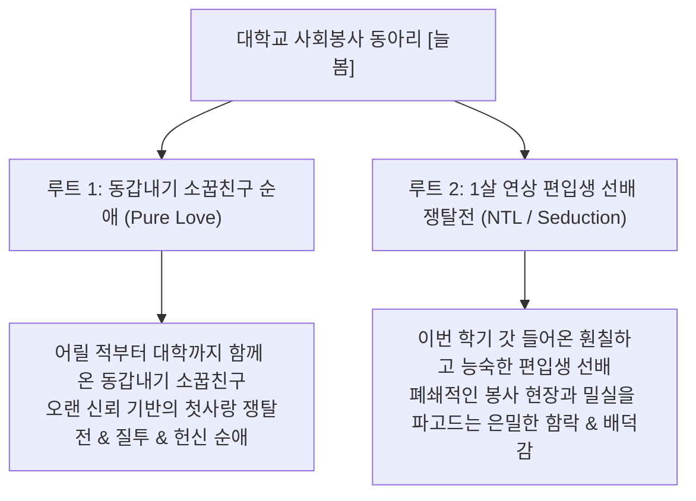

# 🎓 [ykn] 대학교 사회봉사 동아리 [늘봄] 공식 세계관 및 시나리오 설정집

> **작품 개요**: 명문 대학교의 유서 깊은 사회봉사 동아리 **[늘봄]**을 무대로, 성인이 되어 대학에 입학한 명문가 네쌍둥이 자매와 두 가지 상반된 주인공 포지션이 얽히는 멀티 루트 비주얼 노벨 프로젝트.

---

## 🏛️ 1. 무대 및 배경 설정

### 1.1 주요 활동 무대
- **동아리방 (학생회관 304호)**: 소파, 회의용 테이블, 봉사활동 물품 박스가 쌓여있는 아늑하면서도 밀폐된 공간. 늦은 밤 단둘이 서류 작업이나 비품 정리를 하며 은밀한 접촉이 일어나는 핵심 장소.
- **봉사활동 현장**: 아동복지센터, 노인 요양원, 유기동물 보호소, 벽화 봉사, 농촌 봉사활동 등. 땀 흘리는 일상적인 스킨십과 돌발 이벤트 발생.
- **동아리 엠티(MT) & 합숙 펜션**: 외딴 시골 펜션에서 벌어지는 술자리, 진실게임, 심야 산책, 방 배정 혼선으로 인한 밀착 씬.
- **봉사 후 캠퍼스 뒤풀이 주점**: 술에 취해 흐트러진 자매들의 본심과 스킨십이 개화하는 공간.

---

## 🌸 2. 네쌍둥이 4자매 대학생 캐릭터 프로필

| 구분 | 1녀 설유아 (Yua) | 2녀 설세린 (Serin) | 3녀 설시아 (Sia) | 4녀 설하율 (Hayul) |
| :--- | :--- | :--- | :--- | :--- |
| **전공** | 사회복지학과 1학년 | 경영학과 1학년 | 의류디자인학과 1학년 | 체육교육학과 1학년 |
| **동아리 직책** | 부회장 / 봉사기획 | 총무 / 회계관리 | 홍보부장 / SNS 관리 | 대외협력 / 실무부장 |
| **헤어스타일** | **단일 사이드 포니테일** | **정통 히메컷 (Hime Cut)** | **하이 포니테일 (High Ponytail)** | **어깨 세미롱 (노이어링)** |
| **체형 / 의상** | 풍만한 대흉 / 파스텔 카디건 | 굴곡진 힙라인 / 클래식 니트스커트 | 요염 슬렌더 / 트렌치 & 체크스커트 | 쿨 슬렌더 / **언더붑 크롭티 & 청바지** |
| **성격 키워드** | 메가데레, 포용력, 모성애 | 쿨뷰티, 차도녀, 철저함 | 츤데레, 새침함, 자존심 | 과묵 쿠데레, 묵묵한 실무, 반전 테크닉 |
| **동아리 내 면모** | 누구에게나 다정하며 아이들을 보살피는 천사 | 깐깐한 회비 영수증 검사 뒤에 서툰 챙김 | 도도하게 굴지만 칭찬 한마디에 붉어지는 홍보 | 묵묵히 무거운 짐을 나르며 땀 닦는 행동파 |

---

## 🎭 3. 듀얼 주인공 루트 시스템 (Dual Protagonist Routes)

### 💙 주인공 설정 1: 동갑내기 소꿉친구 순애 루트 (Pure Love)
- **주인공 포지션**: 4자매와 어릴 적부터 같은 동네에서 자라온 **동갑내기 소꿉친구 (1학년)**.
- **관계성**: 초·중·고를 함께 거쳐 같은 대학, 같은 봉사 동아리까지 함께 입학한 절대적인 신뢰 관계.
- **주요 테마**:
  - *"우리가 대학생이 되어도, 넌 언제나 내 곁에 있을 줄 알았어."*
  - 4자매 모두 주인공을 마음속 깊이 짝사랑하고 있으나, 자매들끼리의 눈치싸움 때문에 고백하지 못하고 있던 상황.
  - 성인이 된 후 음주, 엠티, 단둘이 남겨진 봉사 현장에서 소꿉친구의 선을 넘나드는 달콤하고 애틋한 순애보.

### 🖤 주인공 설정 2: 1살 연상 편입생 선배 쟁탈전 루트 (NTL / Seduction)
- **주인공 포지션**: 타 명문 대학에서 이번 학기에 편입해 온 **1살 연상 편입생 선배 (2학년/3학년)**.
- **관계성**: 사회봉사 동아리에 뒤늦게 신규 부원으로 합류한 매력적이고 여유 넘치는 어른스러운 선배.
- **주요 테마**:
  - *"소꿉친구 놀이는 이제 그만할 때도 됐잖아? 진짜 어른의 연애를 알려줄게."*
  - 소꿉친구와의 미적지근한 관계에 갈증을 느끼거나, 겉으로는 도도하고 완벽해 보이는 자매들의 내면적 결핍을 능숙하게 간파.
  - 늦은 밤 동아리방 야근, 외딴 봉사 현장의 폐쇄된 창고, 엠티의 어두운 뒤뜰 등에서 한 명씩 은밀하게 공략하여 함락시키는 치명적이고 자극적인 배덕 시나리오.
